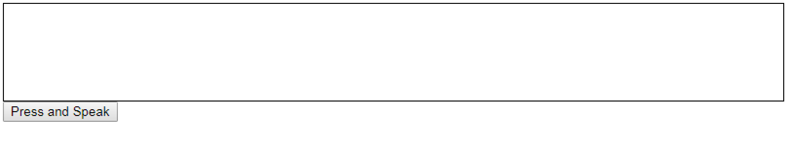

# Prerequisites
  - Microsoft Speaker Recognition API
  - FFmpeg
  - Tomcat

# Steps
  - Change Authentication.java
  - Change config.properties and logback.xml
  - Build and deploy to tomcat

# Demo
  - Start up Tomcat and visit http://localhost:8080/speakerRecognition/

  - Keep pressing the button and say something

  - Wait for a while after recording

  - The response could be seen as below
