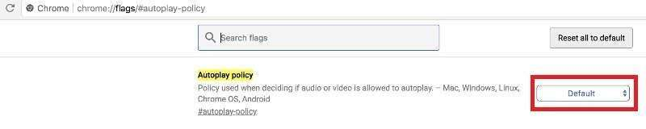
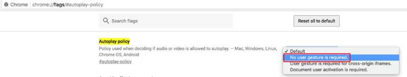
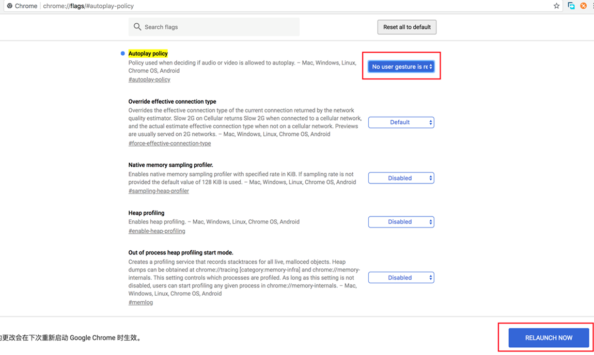
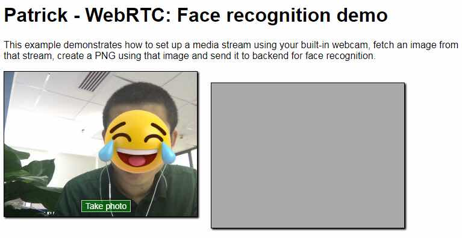
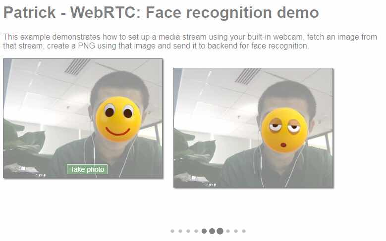
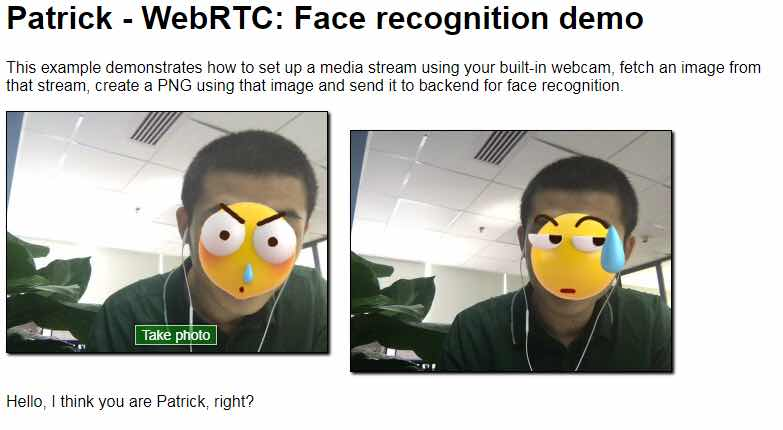

# Prerequisites
  - Microsoft Face Recognition API
  - Camera
  - Tomcat
  - Use Chrome and change its autoplay-policy

# Steps
  - Change Authentication.java
  - Change logback.xml
  - Build and deploy to tomcat

# Demo
  - Start up Tomcat and visit https://localhost:8080/faceRecognition/

  - Look at the camera and click "Take photo"

  - Wait for a while and response could be seen as below

